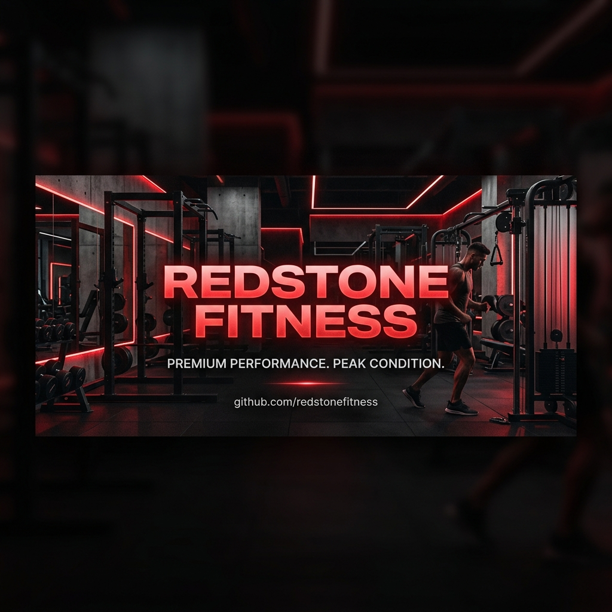

# <p align="center"></p>

<p align="center">
  
  
  
  
  
</p>

<h3 align="center">🔴 REDSTONE FITNESS 🔴</h3>
<p align="center"><strong>Transform Your Body. Transform Your Life.</strong></p>
<p align="center">A premium, highly interactive, and responsive single-page landing application built for a modern fitness studio located in Lucknow, India.</p>

---

## ✨ Features

REDSTONE FITNESS is built to provide an elite digital experience matching the premium nature of the physical gym.

*   **⚡ Premium Landing Experience:** Beautiful visual entrance with a custom `LoadingScreen` and animated text reveal.
*   **🖱️ Mouse Glow Effect:** An immersive custom radial lighting grid (`MouseGlow`) that follows your cursor across the dark-themed canvas.
*   **🎬 Cinematic Parallax Hero:** Dynamic header sections using GSAP ScrollTrigger to scale background imagery and reveal branding animations seamlessly.
*   **📊 Animated Stats & Grid:** Counter animations showcasing key studio milestones (Trainers, Members, Area size).
*   **💎 Glassmorphic Design:** Sleek translucent panels built using Tailwind CSS v4 custom theme tokens, giving the page a premium modern feel.
*   **⚖️ Interactive Success Showcase:** Rich layouts emphasizing physical transformation motivation.
*   **💳 Membership Tiers:** Highly refined, glowing pricing structure for different plans (Gym & Gym + Cardio).
*   **📍 Location & CTA Panel:** Integrated Google Maps link and direct call action tailored for Lucknow fitness enthusiasts.
*   **📱 Fully Responsive Layout:** Designed from the ground up to render flawlessly on smartphones, tablets, and desktop displays.

---

## 🛠️ Technology Stack

| Technology | Purpose |
| :--- | :--- |
| **[Next.js](https://nextjs.org/) (v16.2)** | React framework for structural organization, performance, and SEO. |
| **[React](https://react.dev/) (v19)** | UI rendering and modular components. |
| **[Tailwind CSS](https://tailwindcss.com/) (v4)** | Cutting-edge utility styling using the new CSS-first `@theme` configuration. |
| **[GSAP / ScrollTrigger](https://gsap.com/)** | High-performance, advanced scroll-linked animations and page load timelines. |
| **[Framer Motion](https://www.framer.com/motion/)** | Spring-based physical interactions, hover states, and smooth gesture animations. |
| **[TypeScript](https://www.typescriptlang.org/)** | Type safety and autocompletion for cleaner codebase scalability. |

---

## 📁 Directory Structure

```bash
redsttone/
├── public/                 # Static assets, icons, and banners
├── src/
│   ├── app/                # Next.js App Router core files
│   │   ├── globals.css     # Tailwind imports and custom global styling rules
│   │   ├── layout.tsx      # Main wrapper & metadata configuration
│   │   └── page.tsx        # Homepage importing components
│   └── components/         # Highly decoupled visual elements
│       ├── FinalCTA.tsx    # Conversion signup section
│       ├── FloatingCTA.tsx # Floating quick-join actions
│       ├── Footer.tsx      # Multi-column aesthetic footer
│       ├── Gallery.tsx     # Grid of workout/studio photos
│       ├── Hero.tsx        # Hero section with GSAP parallax scaling
│       ├── LoadingScreen.tsx # Page loader animation
│       ├── Location.tsx    # Details card & Map integration
│       ├── MouseGlow.tsx   # Custom cursor tracking glow
│       ├── Navbar.tsx      # Glassmorphic layout header
│       ├── Pricing.tsx     # Membership plans and discounts
│       ├── ScrollProgress.tsx # Page scroll indicator
│       ├── Stats.tsx       # Achievement statistics counter
│       ├── Testimonials.tsx# Carousel reviews of active members
│       ├── Transformation.tsx # Gym motto and visual showcase
│       └── WhyChooseUs.tsx # Feature grid showcasing trainers & equipment
```

---

## 🚀 Getting Started

Follow these steps to set up the project locally on your machine.

### Prerequisites

Ensure you have **Node.js** (v18+) and **npm** (or yarn/pnpm) installed.

### 1. Clone the Repository

```bash
git clone https://github.com/YOUR_USERNAME/redstone-fitness.git
cd redstone-fitness
```

### 2. Install Dependencies

```bash
npm install
```

### 3. Run the Development Server

```bash
npm run dev
```

Open [http://localhost:3000](http://localhost:3000) with your browser to view the live site.

### 4. Build for Production

```bash
npm run build
npm run start
```

---

## 🎨 Design Theme & Tokens

The app features a custom premium dark design pattern with details configured in `src/app/globals.css`:

*   **Primary Accent:** `#E53935` (Crimson Red)
*   **Secondary Accent:** `#FF1744` (Vibrant Pink/Red)
*   **Dark Background:** `#0A0A0A`
*   **Secondary Dark Container:** `#111111`
*   **Gray Text Color:** `#BDBDBD`
*   **Typography:** Headings use `Anton` (Impact/Sport look) and body content uses `Inter`.

---

## 📞 Studio Contact Details

*   **Location:** Near City Convent School, Rahimabad, Sarojini Nagar, Lucknow - 226008
*   **Phone Contact:** +91 7880513247
*   **Manager:** Fardeen

---

## 📄 License

This project is open-source and available under the [MIT License](LICENSE).
